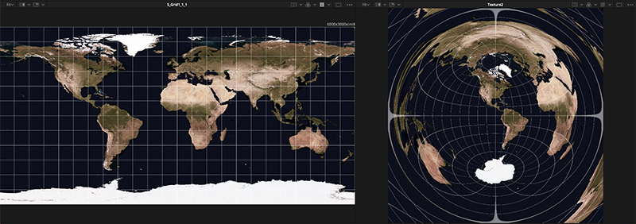
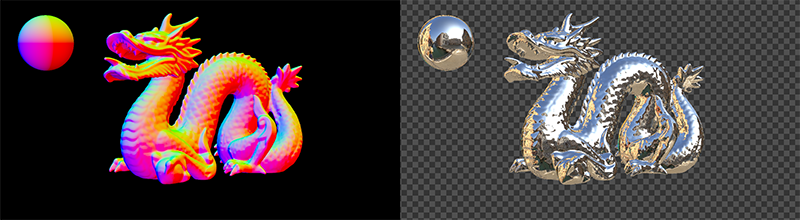

# HS_fusionTools

## System Requirment
BlackmagicDesign FUSION 16 and FUSION STUDIO 16.  
(Probably works with DaVinci Resolve Fusion page)  

macOS, Linux, Windows
 

## Macros
 

### HS_latlongToAngular.setting 
  
Convert Latitude Longitude coord to angular coord. Mainly for environment map or VR comp. 
https://www.youtube.com/watch?v=bAXimme33Mk
  
 
  
 
 
### HS_envRelight.setting 
  
Reflection map with Normal(World) and PointPosition passes.   
https://www.youtube.com/watch?v=SQV2XUlhlIM
